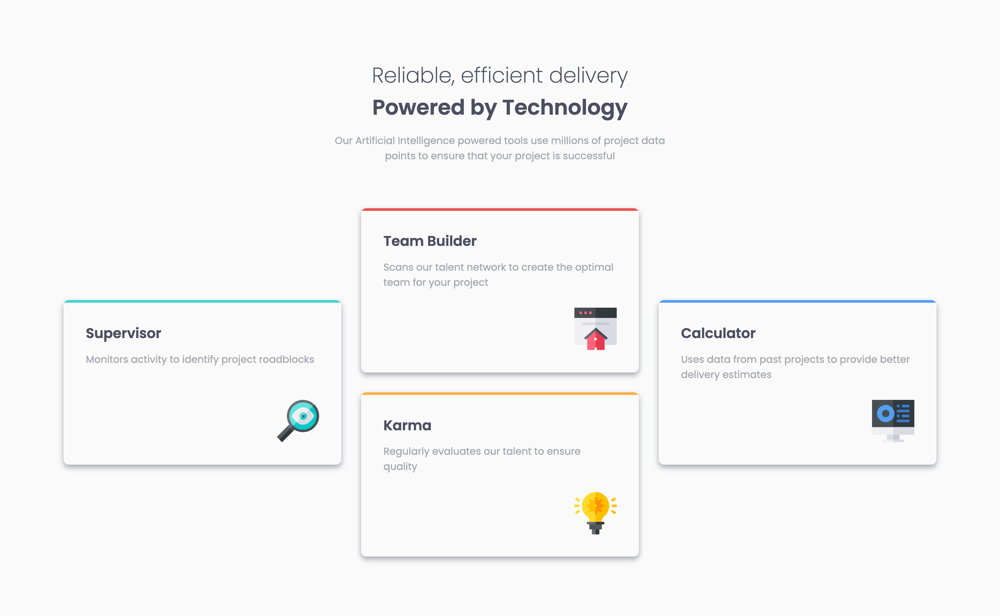
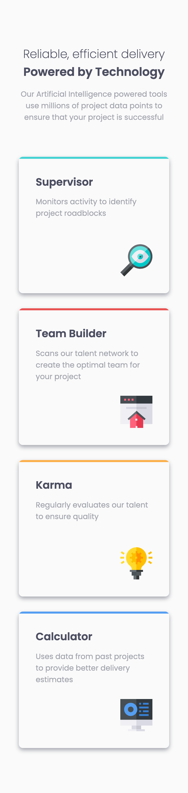

# Frontend Mentor - Four card feature section solution

This is a solution to the [Four card feature section challenge on Frontend Mentor](https://www.frontendmentor.io/challenges/four-card-feature-section-weK1eFYK). Frontend Mentor challenges help you improve your coding skills by building realistic projects.

## Table of contents

- [Frontend Mentor - Four card feature section solution](#frontend-mentor---four-card-feature-section-solution)
  - [Table of contents](#table-of-contents)
  - [Overview](#overview)
    - [The challenge](#the-challenge)
    - [Screenshot](#screenshot)
    - [Links](#links)
  - [My process](#my-process)
    - [Built with](#built-with)
    - [What I learned](#what-i-learned)
    - [Continued development](#continued-development)
  - [Author](#author)
  - [Acknowledgments](#acknowledgments)

## Overview

### The challenge

Users should be able to:

- View the optimal layout for the site depending on their device's screen size

### Screenshot

Desktop:

Mobile:

### Links

- Solution URL: [GitHub Repo](https://github.com/PatricioZarauz/four-card-feature-section-master)
- Live Site URL: [Vercel](https://four-card-feature-section-master-tan-ten.vercel.app/)

## My process

### Built with

- Semantic HTML5 markup
- CSS Grid
- Mobile-first workflow
- SASS

### What I learned

The main thing that I learned was the usage of `grid-template-areas` and improve my overall knowledge of css grid

### Continued development

Any accessibility suggestions are welcomed as well as any code improvements.

## Author

- Frontend Mentor - [@PatricioZarauz](https://www.frontendmentor.io/profile/PatricioZarauz)

## Acknowledgments

I want to shout-out both @Grace-Snow and @AlexKMarshall who help me out with the desktop grid template area.
